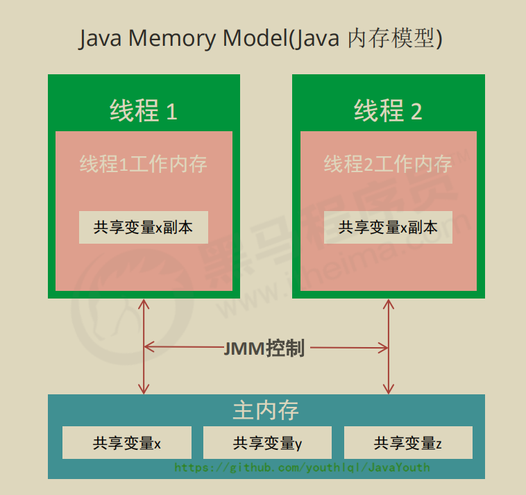
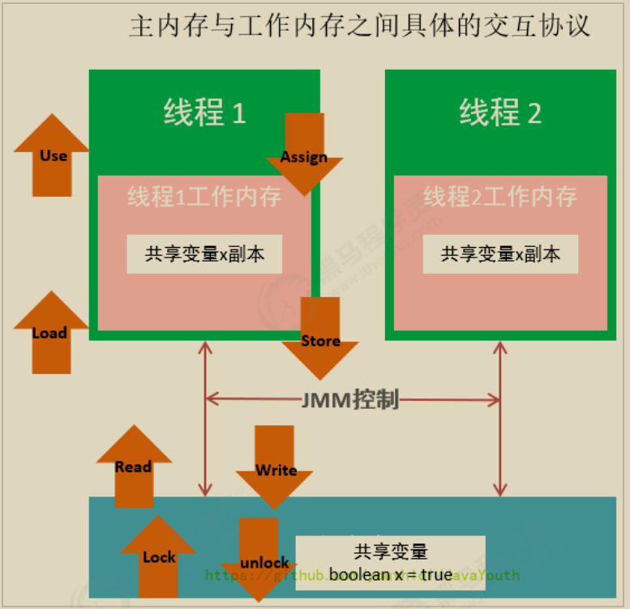

# 并发编程理论

# 并发编程三大问题

并发编程-多线程编程中需要解决的三个问题，或者说是三个基本原则。

- 可见性。

- 原子性。

- 有序性。


## 可见性

可见性（Visibility）：是指一个线程对共享变量进行修改，其他线程可以立即得到修改后的新值。

> 解决方案： Java 中 提供了`Volatile`关键字俩保证线程共享变量的可见性。

验证示例：

```java
package com.xiaocai.juc.threeproblem;

import java.util.concurrent.TimeUnit;

/**
 * @description: TODO 功能角色说明：
 * TODO 描述：
 * @author: 张小菜
 * @date: 2020/12/25 15:31
 * @version: v1.0
 */
public class VisibilityTest {

    public static void main(String[] args) {
        DataResource dataResource = new DataResource();

        new Thread(() ->{
            System.out.println(Thread.currentThread().getName() + "\t come in ");
            try {
                TimeUnit.SECONDS.sleep(3);
            } catch (InterruptedException e) {
                e.printStackTrace();
            }
            //睡3秒之后再修改num,防止A线程先修改了num,那么到while循环的时候就会直接跳出去了
            dataResource.dataAdd();
            System.out.println(Thread.currentThread().getName() + "\t come out");
        },"A").start();


        while(dataResource.num == 0){
            //只有当num不等于0的时候,才会跳出循环
        }
    }
}
class DataResource{
    int num = 0;

    public void dataAdd(){
        this.num = 10;
    }
}
```
当没有加`Volatile`的时候,while循环永远不会退出。当`num`变量加了`Volatile`关键字， 一旦`num`被修改，其他线程就可以立即感知。

由此可见 **关键字`Volatile`，可以保证线程的可见性。**

注意事项
>这里使用的是while循环，可以不停的去获取值，在实际实际开发中，使用`Volatile`修饰的变量，尽量避免使用`if`语句判断，因为`if`语句只会执行一次，并且有可能在变量值修改前执行或者在值修改后执行。


## 原子性

原子性（Atomicity）：在一次或多次操作中，要么所有的操作都成功执行并且不会受其他因素干扰而中 断，要么所有的操作都不执行或全部执行失败。不会出现中间状态，不会出现部分成功部分失败。

> 解决方案
（1）使用锁机制，使用`synchronized`关键字，或者使用Lock锁。
（2）使用原子型的变量。 可以使用原子型的类，如`AtomicInteger`、`AtomicLong`。

验证示例：

```java
package com.xiaocai.juc.threeproblem;

/**
 * @description: TODO 功能角色说明：
 * TODO 描述：
 * @author: 张小菜
 * @date: 2020/12/25 15:43
 * @version: v1.0
 */
public class AtomicityTest {

    public static void main(String[] args) {
        DataResource02 dataResource02 = new DataResource02();

        for (int i = 0; i < 20; i++) {
            new Thread(() ->{
                for (int j = 0; j < 1000; j++) {
                    dataResource02.increment();
                }
            },"线程" + String.valueOf(i)).start();
        }

        //需要等待上面的20个线程计算完之后再查看计算结果
        while(Thread.activeCount() > 2){
            Thread.yield();
        }

        System.out.println("20个线程执行完之后num:\t" + dataResource02.num);
    }
}

class DataResource02{
    static int num = 0;

    public void increment(){
        this.num++;
    }
}
```
输出结果：

```
20个线程执行完之后num:	19152
```
多运行几次之后，会发现每次结果不一样，因为现在是并发不安全的执行。如果保证每次操作都保证原子性，20个线程执行完，结果应该是20000。控制台输出的值却不是这个值，说明出现了原子性的问题，其实就是当一个线程对共享变量操作到一半时，另外的线程也有可能来操作共 享变量，干扰了前一个线程的操作。


使用`synchronized`关键字 修饰操作之后，可以得出正确的计算结果。


## 有序性

有序性（Ordering）：是指程序中代码的执行顺序，Java在编译时和运行时会对代码进行重排序优化操作来加快速度，会导致程序终的执行顺序不一定就是我们编写代码时的顺序。


有序性不太好直接演示。好像可以通过 jcstress 压测工具进行演示。

引入一个包

```xml
<dependency>   
 <groupId>org.openjdk.jcstress</groupId>    
<artifactId>jcstress-core</artifactId>    
<version>${jcstress.version}</version> 
</dependency>
```
关键的几个注解，借用一下代码：

```java
 @JCStressTest
 // @Outcome: 如果输出结果是1或4，我们是接受的(ACCEPTABLE)，并打印ok
 @Outcome(id = {"1", "4"}, expect = Expect.ACCEPTABLE, desc = "ok")
 //如果输出结果是0，我们是接受的并且感兴趣的，并打印danger
 @Outcome(id = "0", expect = Expect.ACCEPTABLE_INTERESTING, desc = "danger")
 @State
 public class Test03Ordering {

    int num = 0;
    boolean ready = false;
    // 线程1执行的代码
    @Actor //@Actor：表示会有多个线程来执行这个方法
    public void actor1(I_Result r) {
        if (ready) {
            r.r1 = num + num;
        } else {
            r.r1 = 1;
        }
    }

    // 线程2执行的代码
    // @Actor
    public void actor2(I_Result r) {
        num = 2;
        ready = true;
    }
} 
```
这里就不演示了。


# Java 内存模型

`Java Memory Molde` (Java内存模型/JMM)，注意不要将Java内存模型和Java内存结构（JVM划分的那个堆，栈，方法区）混淆。

（1）Java 内存模型，是Java虚拟机规范中所定义的一种内存模型，是一套规范，Java内存模型是标准化的，屏蔽掉了底层不同计算机的区别。描述了Java程序中各种变量（线程共享变量）的访问规则，以及在JVM中将变量存储到内存和从内存中读取变量这样的底层细节。

（2）Java 内存模型主要围绕两个关键字，一个是`volatile`，一个是`synchronized`。

## 关于Java内存模型的内容

Java内存模型中，根据线程将内存分为主内存和工作内存。

Java的线程不能直接在主内存中操作共享变量。而是首先将主内存中的共享变量赋值到自己的工作内存中，再进行操作，操作完成之后，刷回主内存。

**主内存：**

主内存是所有线程都共享的，都能访问的。所有的共享变量都存储于主内存。

**工作内存：**

每一个线程有自己的工作内存，工作内存只存储该线程对共享变量的副本。线程对变量的所有的操 作(读，取)都必须在工作内存中完成，而不能直接读写主内存中的变量，不同线程之间也不能直接 访问对方工作内存中的变量。



为什么要有JMM?

Java内存模型是一套在多线程读写共享数据时，对共享数据的可见性、有序性、和原子性的规则和保障。


## 主内存与工作内存交互

为了保证数据交互时数据的正确性，Java内存模型中定义了8种操作来完成这个交互过程，这8种操作本身都是原子性的。虚拟机实现时必须保证下面 提及的每一种操作都是原子的、不可再分的。 




- `lock`：作用于主内存的变量，它把一个变量标识为一条线程独占的状态。

- `unlock`：作用于主内存的变量，它把一个处于锁定状态的变量释放出来，释放后的变量才可以被其它线程锁定。

- `read`：作用于主内存的变量，它把一个变量的值从主内存传输到线程的工作内存中，以便随后的load动作使用。

- `load`：作用于工作内存的变量，它把read操作从主内存中得到的变量值放入工作内存的变量副本中。

- `use`：作用于工作内存的变量，它把工作内存中一个变量的值传递给执行引擎，每当虚拟机遇到一个需要使用到变量的值的字节码指令时都会执行这个操作。

- `assign`：作用于工作内存的变量，它把一个从执行引擎接收到的值赋给工作内存的变量，每当虚拟机遇到一个给变量赋值的字节码指令时执行这个操作。

- `store`：作用于工作内存的变量，它把工作内存中一个变量的值传送到主内存中，以便随后的write使用。

- `write`：作用于主内存的变量，它把store操作从工作内存中得到的变量的值放入主内存的变量中。

注意:

（1）如果对一个变量执行`lock`操作，将会清空工作内存中此变量的值。 

（2）对一个变量执行`unlock`操作之前，必须先把此变量同步到主内存中。 

（3）`lock`和`unlock`操作只有加锁才会有。`synchronized`就是通过这样来保证可见性的。 


## happens-before


JMM 使用 happens-before 的概念来定制两个操作之间的执行顺序。这两个操作可以在一个线程以内，也可以是不同的线程之间。因此，JMM 可以通过 **happens-before** 关系向程序员提供跨线程的内存可见性保证。

**为什么要 happens-before ？**

JVM 会对代码进行编译优化，会出现指令重排序情况，为了避免编译优化对并发编程安全性的影响，需要 happens-before 规则定义一些禁止编译优化的场景，保证并发编程的正确性。

**基本含义：**

（1）如果一个操作 happens-before 另一个操作，那么第一个操作的执行结果将对第二个操作可见，而且第一个操作的执行顺序排在第二个操作之前。

（2）两个操作之间存在 happens-before 关系，并不意味着Java平台的具体实现必须要按照happens-before关系指定的顺序来执行。如果重排序之后的执行结果，与按happens-before关系来执行的结果一致，那么JMM也允许这样的重排序。

如果操作A happens-before操作B，那么操作A在内存上所做的操作对操作B都是可见的，不管它们在不在一个线程。

**happens-before 规则**

在Java中，有以下天然的 happens-before关系：

- 1、程序次序规则：一个线程内，按照代码顺序，书写在前面的操作先行发生于书写在后面的操作

- 2、锁定规则：一个unLock操作先行发生于后面对同一个锁的lock操作，比如说在代码里有先对一个lock.lock()，lock.unlock()，lock.lock()

- 3、volatile变量规则：对一个volatile变量的写操作先行发生于后面对这个volatile变量的读操作，volatile变量写，再是读，必须保证是先写，再读

- 4、传递规则：如果操作A先行发生于操作B，而操作B又先行发生于操作C，则可以得出操作A先行发生于操作C

- 5、线程启动规则：Thread对象的start()方法先行发生于此线程的每个一个动作，thread.start()，thread.interrupt()

- 6、线程中断规则：对线程interrupt()方法的调用先行发生于被中断线程的代码检测到中断事件的发生

- 7、线程终结规则：线程中所有的操作都先行发生于线程的终止检测，我们可以通过Thread.join()方法结束、Thread.isAlive()的返回值手段检测到线程已经终止执行

- 8、对象终结规则：一个对象的初始化完成先行发生于他的finalize()方法的开始


 